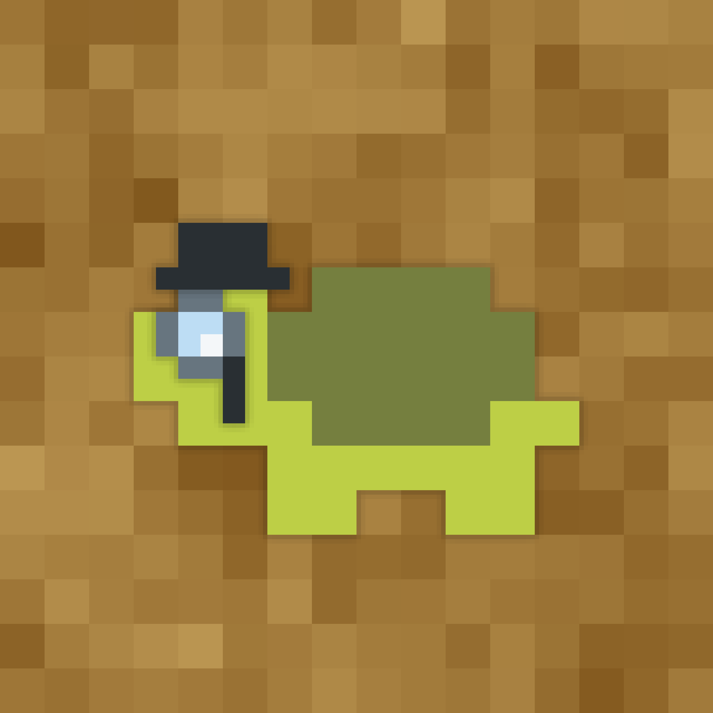

[version-shield]: https://img.shields.io/github/v/release/TurtleException/DiscordCrawler?include_prereleases
[license-shield]: https://img.shields.io/github/license/TurtleException/DiscordCrawler
[build-shield]: https://img.shields.io/github/actions/workflow/status/TurtleException/DiscordCrawler/build.yaml

[![version-shield]](https://github.com/TurtleException/DiscordCrawler/releases)
[![license-shield]](LICENSE)
[![build-shield]](https://github.com/TurtleException/DiscordCrawler/actions/workflows/build.yaml)

# DiscordCrawler
A simple bot to download the contents of a Discord channel or guild - Formatted like a personal data dump.

Works with [JDA](https://github.com/discord-jda/JDA) and [picocli](https://github.com/remkop/picocli) 💚.